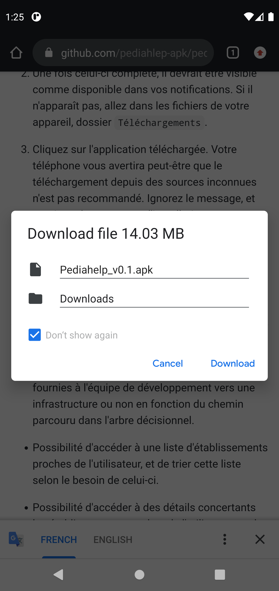
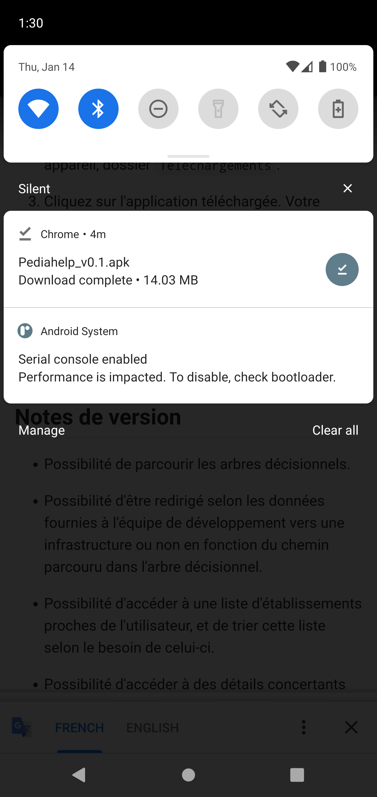
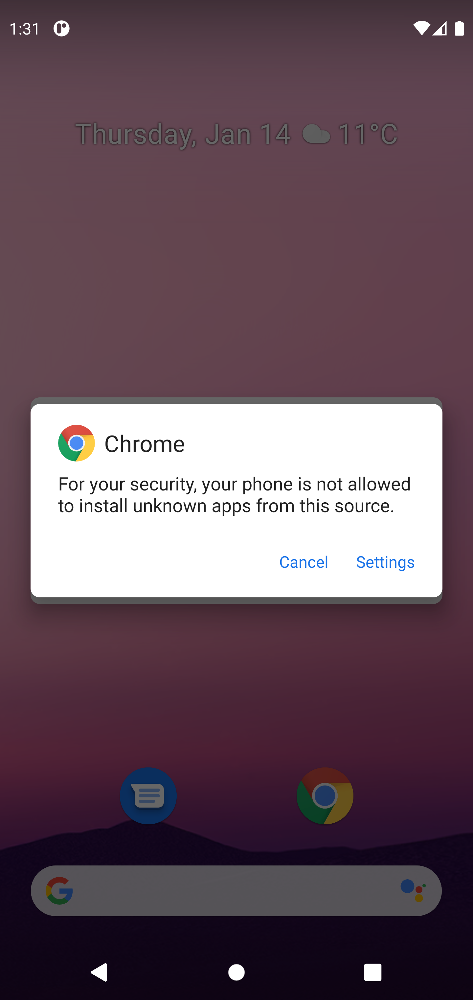
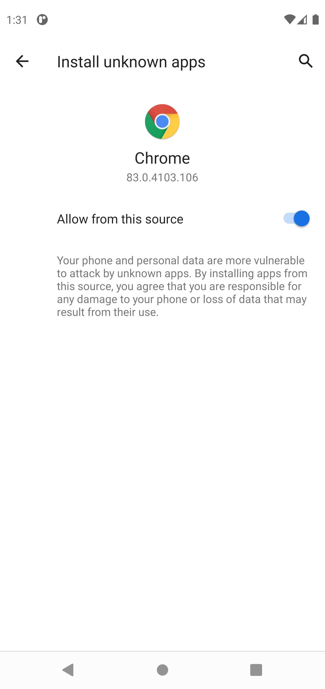
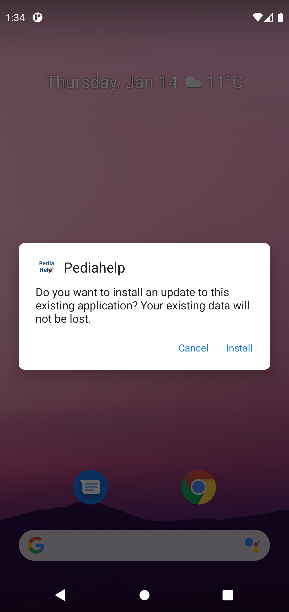
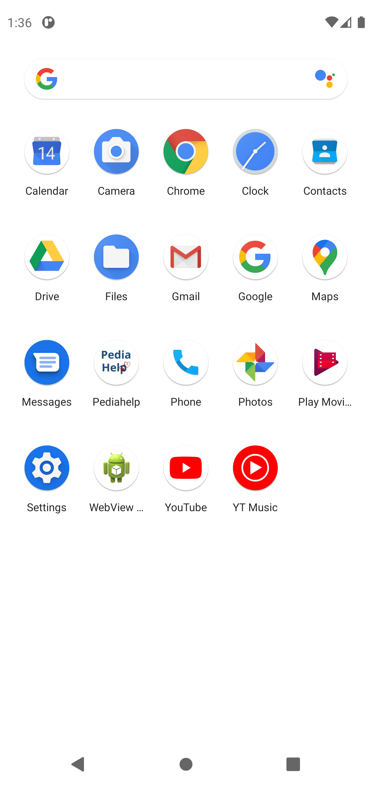

# Instructions téléchargement application

## Rédacteur

LABEYE Loïc

Contact : <loic.labeye@groupe-esigelec.org>

## Instructions

1. Rendez vous sur [ce lien](https://github.com/pediahelp-apk/pediahelp-apk/releases/download/0.1/Pediahelp_v0.1.apk), ou utilisez le QR Code suivant pour commencer le téléchargement.

2. Acceptez le téléchargement

3. Une fois le téléchargement effectué, allez dans votre barre de notifications, et appuyez sur l'élément nommé `Pediahelp_v0.1.apk`

   

4. Votre navigateur va vous informer que par défaut l'installation d'apk via des sources inconnues n'est pas recommandé. Autorisez votre navigateur à installer des fichiers d'applications.

5. Appuyez sur la flèche de retour, ou le boutton retour dans le coin supérieur gauche. L'application devrait maintenant être proposée à l'installation, acceptez.

   

6. Celle-ci devrait maintenant figurer dans votre liste d'applications, et être prête à l'emploi.

